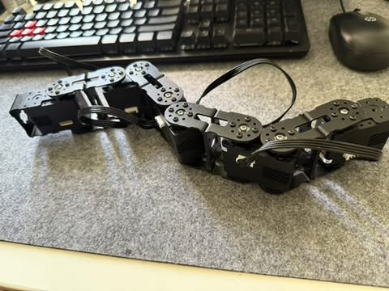
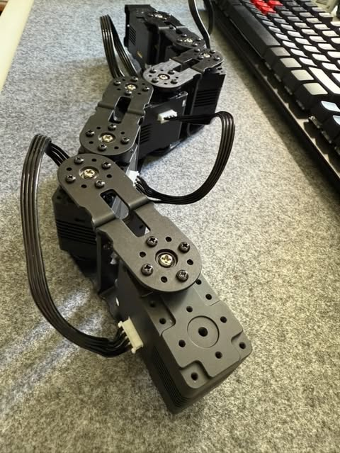

# Getting started with Lynxmotion servomotors

## Introduction

For creating your own robotic body, we used [Lynxmotion smart servomotors](https://wiki.lynxmotion.com/info/wiki/lynxmotion/view/ses-v2/lynxmotion-smart-servo/).


These motors are easier to control than a standard servomotor because they 
include a microcontroller that implements a serial communication protocol. The electronics inside the servo include the following:
- H-bridge motor controller
- Microcontroller (Cortex M0)
- Magnetic position sensor
- Voltage sensor
- Temperature sensor
- Current sensor

In [serial communication](https://learn.sparkfun.com/tutorials/serial-communication), bits are transmitted in sequence (in opposition to parallel communication), and the number of wires is minimal: basically a receiver RX, a transmitter TX, and GND.


The block of circuitry responsible for implementing serial communication is called universal asynchronous receiver-transmitter (UART).

Serial communication is available basically in any microcontroller.

Each Lynxmotion servo has an ID (a number) that is used in the communication. In this project, we have many servo and for this we create loop and each servo ID went through this loop and perform specific movement.

# 🐍✨ Snake-Like Search and Rescue Robot — README.md

## 🚨 Overview

This project presents a **snake-inspired robotic system** using 11 servo motors, designed to replicate snake-like locomotion. The robot uses a traveling sine wave motion to navigate through narrow spaces and difficult terrain, with additional tires on the first and last segments to improve movement efficiency.

Inspired by biological snakes and their ability to move flexibly in confined environments, this robot is designed as a **potential solution for search and rescue missions** in disaster-affected regions such as Japan, which are prone to frequent earthquakes and tsunamis.

---

## 💡 Motivation

Natural disasters like earthquakes and tsunamis often cause building collapses and create debris fields that are difficult or impossible for human rescuers or traditional wheeled robots to traverse. Snakes, on the other hand, can:

- Move through tight gaps and under debris.
- Change their shape and adapt to obstacles.
- Traverse irregular and unstable surfaces.

By mimicking this natural locomotion, our robotic snake aims to **reach trapped survivors**, deliver sensors, or even provide basic supplies in areas that are inaccessible to conventional rescue robots.

---

## ⚙️ Technical Design

### ✨ Hardware

- **Servos**: 11 Lynxmotion servo motors.
- **Mounting**: Each servo connected using C brackets to create a continuous articulated body.
- **Tires**: First and last segments equipped with wheels (tires) to improve traction and push/pull capabilities.
- **Controller**: Raspberry Pi Zero (small form factor, low power consumption).
- **Power supply**: External battery pack capable of supporting all servos simultaneously.

### 🧬 Motion Principle

The snake movement is achieved by generating a **traveling sine wave** along the body:

- Each servo moves in a sinusoidal pattern with a phase offset from its neighbors.
- Amplitude and frequency can be controlled to change the gait (e.g., faster or slower, tighter or smoother turns).
- The wheels on the first and last segments help convert lateral undulation into forward motion, reducing slippage.

### 🧑‍💻 Software

- **Programming language**: Python 3
- **Control method**: UART communication with servos via serial port.
- **Wave parameters**:
  - **Amplitude**: Adjustable up to 30° for safe, smooth motion.
  - **Phase offset**: π/6, controlling the shape and spread of the wave.
  - **Period**: 2 seconds per full wave cycle, adjustable for speed control.
- **Safety features**:
  - Gradual ramp-up and ramp-down of amplitude to avoid sudden stress on joints.
  - Automatic neutral reset upon interruption (Ctrl+C).

---

## 🚑 Potential Use Cases

### 🏚 Disaster search and rescue

- Navigate collapsed structures after earthquakes.
- Inspect areas under rubble without disturbing debris.
- Carry cameras, microphones, or gas sensors to detect trapped survivors.

### 🌊 Flooded or underwater areas

- Snake robots with waterproofing can potentially navigate flooded zones caused by tsunamis.

### 🔬 Industrial inspection

- Explore pipes, tunnels, or machinery spaces that are too tight for humans.

### 🌿 Environmental monitoring

- Move through dense vegetation or uneven forest terrain to collect samples or monitor wildlife.

---

## 💬 Future Improvements

- Add **wireless camera module** for real-time video feedback.
- Incorporate **distance or thermal sensors** for obstacle detection and victim location.
- Implement **autonomous navigation algorithms** (e.g., SLAM, AI-based path planning).
- Improve modular design for easier maintenance and scalability.
- Add more wheels or hybrid modules to improve friction and terrain adaptation.

---

## 🛠 How to Use

### ⚡ Requirements

- Raspberry Pi Zero
- Python 3
- Lynxmotion servos (configured with custom IDs)
- External power supply capable of handling 11 servos

### ▶️ Run

```bash
python3 snake_robot.py
```

- The robot will automatically start generating a traveling sine wave motion.
- Press `Ctrl + C` to stop safely and reset servos to neutral.

---

## ⚖️ Limitations

- Current system is teleoperated and lacks obstacle detection or autonomous decision-making.
- Motion efficiency depends on surface friction and terrain complexity.
- Limited battery capacity for extended missions.

---

## 🌏 Why Japan?

Japan is particularly vulnerable to earthquakes and tsunamis, with large urban centers built near fault lines and along the coast. After events like the 2011 Tōhoku earthquake and tsunami, rescue efforts were hindered by inaccessible rubble and hazardous conditions.  
Snake robots can provide a new tool to **improve survival rates**, speed up rescue operations, and reduce risks to human responders.

---

## 🤝 Contributions

Contributions, suggestions, and collaborations are welcome!

- Feel free to fork the repository and submit pull requests.
- Open issues for bugs, ideas, or enhancements.
- Contact me directly for joint research or university/industry collaborations.

---

## 📷 Gallery



--------------------



## ⭐ Conclusion

This robotic snake is an innovative step toward **biologically inspired robots for real-world humanitarian missions**. Through continued development and collaboration, it has the potential to become an essential tool in future disaster response scenarios.
